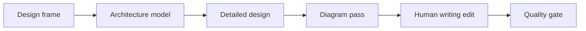

# Technical Design Doc Skill

[](https://github.com/Scorpio69t/technical-design-doc/actions/workflows/ci.yml)
[](https://github.com/Scorpio69t/technical-design-doc/releases/latest)
[](LICENSE.txt)
[](https://agentskills.io/specification)

English | [简体中文](README.zh-CN.md)

`technical-design-doc` is a portable Agent Skill for creating, rewriting, and reviewing implementation-level software design documents for human readers.

It turns a vague request such as “write a detailed design” into a six-pass architecture workflow with consistent terminology, fit-for-purpose diagrams, failure-path analysis, human-readable rationale, and a final quality gate.

> [Download the latest ZIP release](https://github.com/Scorpio69t/technical-design-doc/releases/latest) or clone the repository using one of the installation commands below.

## Why this skill exists

AI-generated design documents often fail in predictable ways:

- one oversized diagram attempts to explain everything;
- service and module names drift between prose and diagrams;
- sequence diagrams show only the happy path;
- recommendations are mixed with committed decisions;
- prose reads like an agent work log rather than an engineering document;
- architecture choices are asserted without constraints or tradeoffs.

This skill addresses those failures as a repeatable engineering process rather than a larger prompt.



## What is included

- a focused `SKILL.md` with a six-pass workflow;
- C4 and Structurizr model-as-code guidance;
- Mermaid flowchart, state, and ER conventions;
- PlantUML sequence-diagram conventions and shared styling;
- rules for removing agent-like and low-information prose;
- templates for detailed design, modules, APIs, databases, ADRs, and reviews;
- a complete example with Structurizr, Mermaid, and PlantUML sources;
- a dependency-free Python linter for common document smells;
- a package validator and deterministic release packager.

The diagram strategy is intentionally mixed:

| Reader question | Preferred notation |
|---|---|
| Who uses the system and what surrounds it? | Structurizr/C4 System Context |
| What deployable services exist? | Structurizr/C4 Container |
| How is one service decomposed? | Structurizr/C4 Component |
| How are runtime nodes arranged? | Structurizr Deployment |
| How does a business or data flow branch? | Mermaid Flowchart |
| How does an entity or job change state? | Mermaid State Diagram |
| What are the main data relationships? | Mermaid ER Diagram |
| Who calls whom, including failures? | PlantUML Sequence Diagram |

The goal is not more diagrams. It is fewer diagrams with clearer jobs.

## Installation

Choose one location. Keep the entire directory; `references`, `assets`, and `scripts` are part of the skill.

### Install with the [Skills CLI](https://github.com/vercel-labs/skills) (recommended)

Install interactively and choose the target agents:

```bash
npx skills add Scorpio69t/technical-design-doc
```

Install globally for Codex without prompts:

```bash
npx skills add Scorpio69t/technical-design-doc -g -a codex --copy -y
```

Install into the current project for Codex:

```bash
npx skills add Scorpio69t/technical-design-doc -a codex --copy -y
```

Replace `codex` with another supported agent such as `claude-code` or `cursor`, or pass several agent names after `-a`. To inspect the repository before installing, run:

```bash
npx skills add Scorpio69t/technical-design-doc --list
```

If npm must use a local HTTP proxy, configure it for the current shell first. For example, in PowerShell:

```powershell
$env:HTTP_PROXY = "http://127.0.0.1:7897"
$env:HTTPS_PROXY = "http://127.0.0.1:7897"
npx skills add Scorpio69t/technical-design-doc -g -a codex --copy -y
```

The commands above were verified with Skills CLI 1.6.0. `--copy` creates a self-contained installation instead of an agent-directory symlink.

### Codex and compatible clients

User-level installation:

```bash
git clone https://github.com/Scorpio69t/technical-design-doc.git ~/.agents/skills/technical-design-doc
```

Project-level installation, run from the project root:

```bash
git clone https://github.com/Scorpio69t/technical-design-doc.git .agents/skills/technical-design-doc
```

Codex users may also invoke `$skill-installer` and ask it to install this GitHub repository. Codex discovers changes automatically; restart it if the skill does not appear.

### Claude Code

```bash
git clone https://github.com/Scorpio69t/technical-design-doc.git ~/.claude/skills/technical-design-doc
```

For a repository-scoped skill, clone it to `.claude/skills/technical-design-doc` instead.

### Cursor

Cursor discovers the cross-client `.agents/skills` locations shown above. Its native alternatives are `.cursor/skills/technical-design-doc` for a project and `~/.cursor/skills/technical-design-doc` for a user.

### ZIP installation

Download the versioned ZIP from [GitHub Releases](https://github.com/Scorpio69t/technical-design-doc/releases/latest), verify it with the adjacent SHA-256 file, and extract the top-level `technical-design-doc` directory into one of the locations above.

## Use

Invoke the skill by name or let a compatible agent select it from the task description.

```text
Use technical-design-doc to turn this PRD and the current repository into an
implementation-level detailed design. Preserve existing service names. Use C4
for architecture, PlantUML for the critical write path, Mermaid for state
transitions, and run the quality gate before finalizing.
```

```text
Review this design with technical-design-doc without rewriting it. Find diagram
overload, boundary ambiguity, missing failure paths, naming drift, and agent-like
prose. Return a prioritized review report with exact section references.
```

More prompts are available in [usage recipes](references/usage-recipes.md).

## Optional rendering tools

The skill produces diagram source and does not install or call remote rendering services. Install a renderer only when you need exported images:

- [Mermaid](https://mermaid.js.org/) for Markdown-native flow, state, and ER diagrams;
- [PlantUML](https://plantuml.com/) for sequence diagrams;
- [Structurizr](https://docs.structurizr.com/) for C4 architecture models and views.

The validation and linting scripts use only the Python standard library and support Python 3.9 or newer.

## Validate locally

```bash
python scripts/validate_skill.py .
python scripts/lint_design_doc.py examples/sample-detailed-design.md --strict
python -m unittest discover -s tests -v
python scripts/package_skill.py --output-dir dist
```

The document linter is deliberately heuristic: its findings are review hints, not architecture judgments.

## Repository layout

```text
technical-design-doc/
├── SKILL.md
├── agents/openai.yaml
├── assets/
│   ├── styles/
│   └── templates/
├── examples/
│   └── diagrams/
├── references/
├── scripts/
└── tests/
```

## Contributing and security

Contributions are welcome. Read [CONTRIBUTING.md](CONTRIBUTING.md) before opening a pull request. Use [GitHub Discussions](https://github.com/Scorpio69t/technical-design-doc/discussions) for usage questions and [GitHub Issues](https://github.com/Scorpio69t/technical-design-doc/issues) for reproducible bugs and proposals.

Do not open a public issue for a vulnerability or prompt-injection concern. Follow [SECURITY.md](SECURITY.md) instead.

## License

Released under the [MIT License](LICENSE.txt).
