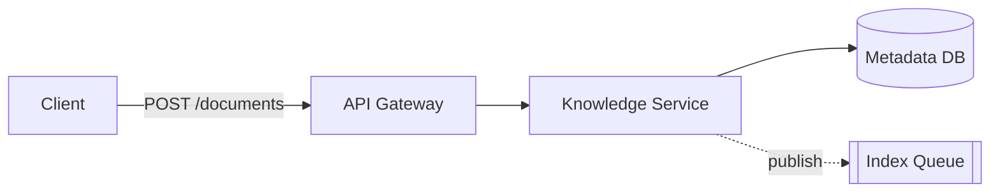
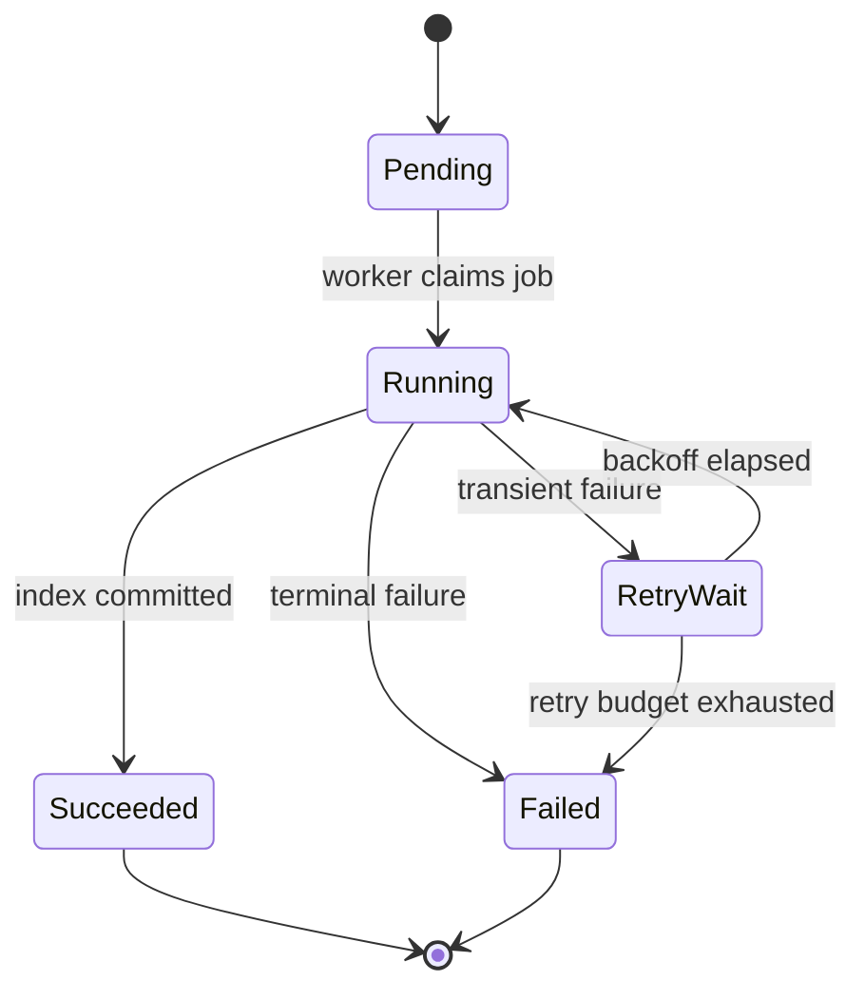

# Mermaid Style Guide

Use Mermaid when Markdown-native portability is valuable and the diagram is a flowchart, state model, ER model, or compact architecture/data-flow view.

## Current configuration direction

Prefer Mermaid frontmatter configuration rather than deprecated inline directives.

Use `layout: elk` for complex flow/state/class/ER diagrams when the target renderer supports current Mermaid releases. Current Mermaid versions use ELK as the default layout for several diagram types, but explicit configuration may improve portability of intent.

A reusable starting point is provided in `assets/styles/mermaid-frontmatter.txt`.

## Flowcharts

Choose direction to reduce crossings:

Use shapes consistently:
- rectangle/rounded rectangle: process/service;
- cylinder: durable store;
- subroutine/stadium only when the semantic distinction matters;
- subgraphs: stable domain/layer boundary, not decorative grouping.

Keep labels short. Put detailed semantics on edges or in the reading guide.

## Subgraphs

Subgraphs should represent something real, such as:
- trust zone;
- domain;
- application layer;
- deployment boundary;
- external systems.

Avoid nested subgraphs deeper than two levels in Markdown documents.

## Edge styles

Reserve visual differences for semantics:
- solid: synchronous or direct dependency;
- dotted/dashed: asynchronous/eventual/background interaction;
- emphasized/risk style: exceptional path only when it improves understanding.

If the notation is not obvious, add a one-line legend.

## Node count

A typical flowchart should stay under 12 primary nodes. If more than 14-18 nodes are necessary, first attempt to split the flow by phase or abstraction level.

## State diagrams

Use state diagrams for lifecycle, not for ordinary procedure steps.

Good:

Document guards and terminal states when they encode business behavior.

## Sequence diagrams in Mermaid

Mermaid sequence diagrams are acceptable for simple interactions, especially when a repository requires Mermaid only. Prefer PlantUML when the flow needs several of: `alt`, `opt`, `loop`, nested grouping, references, activation, detailed notes, or a shared style file.

## ER diagrams

Use ER diagrams for relationships, cardinality, and conceptual/logical shape. Do not paste every physical column into an ER diagram when a schema table is easier to read.

Include only fields that explain identity, ownership, lifecycle, or key relationships.

## Architecture diagrams

Mermaid's architecture diagram syntax is useful for compact infrastructure/cloud-resource views. Do not treat it as a replacement for a coherent C4 model when several architecture views must stay consistent.

When the project needs context/container/component/deployment views that evolve together, model them in Structurizr DSL and optionally export views.

## Styling

Use a restrained base theme and semantic classes. Do not assign arbitrary per-node colors.

Avoid hard-coding fonts that may not exist in the renderer. Prefer renderer defaults or organization-approved web-safe fonts.

Do not use tiny font sizes to fit an overloaded diagram. Split the diagram.

## Accessibility

Do not rely on color alone. Labels, shapes, line styles, and grouping should preserve meaning when printed in grayscale.

Ensure text/background contrast remains readable in both light and dark documentation environments when possible.
